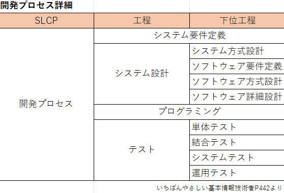

要件定義はなるべくIPAの共通フレームに準拠する。
※ あくまで個人開発のため要点のみ

内容：
ソフトウェアライフサイクルプロセス(SLCP)には以下の５つのプロセスが存在する。
１：規格
２：要件定義
３：開発
４：運用
５：保守

このうち"**開発プロセス**"を重点に説明する。

ちなみに...
IPA共通フレームによる開発プロセス標準化の一環では下記
ISO/IEC 15288, 12207 → JISQ X0170, X0160 → IPA共通フレーム　
って感じになってる。基本IPA共通フレームを準拠する。
